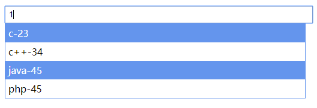

所有组件依赖`jquery`，具体示例请进入`demo`查看
- <a href="#codefalse-input-自动搜索输入框" target="_self">Input输入框搜索</a>
    + <a href="#options-object" target="_self">Options</a>
    + <a href="#callback-functiontext" target="_self">Callback</a>
    + <a href="#methods" target="_self">Methods</a>
    + <a href="#changelog" target="_self">ChangeLog</a>
## Codefalse-Input 自动搜索输入框

[直接下载](https://github.com/codefalse/codefalse-form/releases)
```js
$('#codefalse-input').codefalseInput(options[, callback]);
```
### Options: object
```json
{
    "placeholder": "Please search...",
    "key": "id",
    "value": ["name"],
    "separator": "-",
    "delay": 200,
    "ajax": {
        "type": "GET",
        "url": ""
    },
    "allowInputText": false,
    "searchName": ""
}
```
- placeholder: 输入框提示信息
- key: 渲染数据有关，将渲染的数据中对应的字段值作为单选value
- value: 渲染数据有关，将渲染的数据中对应的所有字段值作为单选的text
- separator: 渲染数据有关，将配置value中所有字段值分割显示
- delay: 单位毫秒，避免搜索文本输入时，input事件返回过于频繁导致的ajax请求频繁
- ajax: 请求有关参数（暂时慎用）
- allowInputText: 是否允许手动输入值，默认不允许
- searchName: 定义搜索框下的name属性，默认为空
### Callback: function(text)
手动输入搜索回调，可实时返回输入的值进行模糊搜索，对返回结果可`adapter`到下拉部分
- text: 手动搜索输入的值，返回频率跟`options.delay`有关，
### Methods
- init(): 默认执行初始化方法。无特殊需求避免显式调用
- adapter(data): 将请求返回数据适配到下拉选择中，data是返回的数组数据,
data中值必须和`options.key`和`options.value`存在对应关系，否则无法准确适配值
- reset([key, value])：key,value分别是搜索结果和搜索文本
- show()：显示
- hide()：隐藏
### ChangeLog
- v1.3.1
1. 关闭搜索框的autoComplete的bug
- v1.3.0
1. 完善输入搜索框，实现可自主输入文本值，而不必全部是搜索结果
2. add options: allowInputText, searchName
- v1.2.0
1. 增加重置(reset),显示(show),隐藏(hide)方法
2. 修复文本框从有到无之后，不触发搜索框下值的回调函数
- v1.1.0
1. 支持点击Enter键，默认选择第一行
2. 优化文本输入请求，加入delay控制