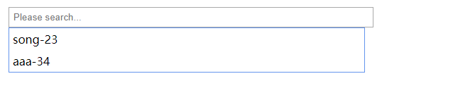

# form表单的扩展
### codefalseInput 自带搜索下拉选择的文本输入框
```html
<link href="../src/css/input.css" rel="stylesheet" type="text/css" />
...
<input id="filed" class="demo" type="text" name="codefalse"/>
...
<script src="https://cdn.bootcss.com/jquery/3.3.1/jquery.js"></script>
<script src="../src/js/input.js"></script>

```
文本输入搜索框[使用说明](https://github.com/codefalse/codefalse-form/wiki/CodefalseInput使用说明)示例如下：

